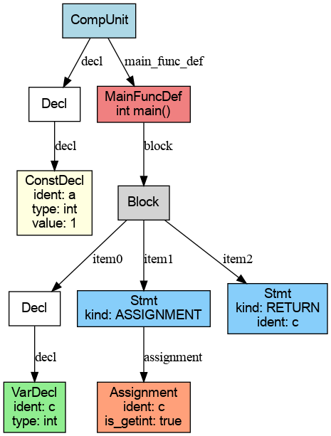
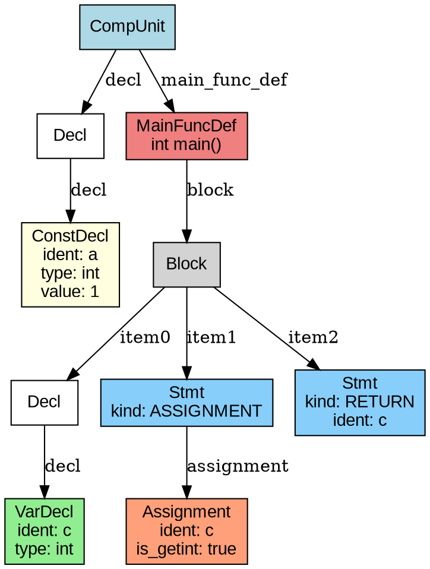

# Flex & Yacc 实验 & 附保姆级教程

【Flex & Yacc 简介】
`Flex` 和 `Yacc` 是一组经典的编译原理工具，分别用于实现词法分析器（Lexer）和语法分析器（Parser）：

- `Flex`：全称为 *Fast Lexical Analyzer Generator*，用于自动生成词法分析器。
- `Yacc`：全称为 *Yet Another Compiler Compiler*，用于生成符合上下文无关文法的语法分析器。

这两个工具通常配合使用，可以快速构建出具有完整前端功能的语言处理器，广泛应用于编译器、解释器、数据处理等系统中。

---

## 实验目标

本次实验，同学们需要使用`Flex`和`Yacc`工具构建`SysY`语言的词法和语法分析器，并构建可视化语法树，例如：



## 实验内容

1. 学习 `flex` 工具，掌握词法规则描述方式，编写一个完整的 `SysY` 语言词法分析器。
2. 在`flex`工具的基础上，借助`yacc`工具实现一个语法分析器，要求编写适当的语义动作，能够按照规约顺序输出需要用到的规约规则
3. 在语法分析器的基础上，构建`SysY`语言的语法树(`ast`树部分定义已给出)，并将语法树打印到文件中，最终使用`graphviz`工具，构建可视化语法树

## 实验输出说明

### Flex实验

输入输出要求同词法分析实验，输出的结果文件中每行按如下方式组织：单词类别码 单词的字符/字符串形式(中间仅用一个空格间隔)

类别码需按下表格式统一定义:

| 单词名称 | 类别码 | 单词名称 | 类别码 | 单词名称 | 类别码 | 单词名称 | 类别码 | 
| ---- | ---- | ---- | ---- | ---- | ---- | ---- | ---- |
| Ident | IDENFR | ! | NOT | * |	MULT | 	=	| ASSIGN |
| IntConst | INTCON | && | AND | / | DIV | ; | SEMICN |
| FormatString | STRCON	| \|\| | OR |	% |MOD	|, |	COMMA |
| main | MAINTK	|while	|WHILETK|	<	|LSS|	(	|LPARENT|
| const	|CONSTTK|	getint|	GETINTTK	|<=|	LEQ|	)|	RPARENT|
| int |	INTTK|	printf	|PRINTFTK|	>	|GRE|	[	|LBRACK|
| break |	BREAKTK|	return|	RETURNTK|	>=	|GEQ|	]	|RBRACK|
| continue |	CONTINUETK	|+	|PLUS|	==	|EQL|	{	|LBRACE|
| if | IFTK | - | MINU	|!=	|NEQ	|}	|RBRACE|
| else | ELSETK	| void | VOIDTK |

输出示例：
```bash
CONSTTK const
INTTK int
IDENFR a
ASSIGN =
INTCON 1
SEMICN ;
INTTK int
...
```

### Yacc实验

输入输出要求同语法分析实验，具体要求如下：

1. 按词法分析识别单词的顺序，按行输出每个单词的信息（要求同词法分析作业，对于预读的情况不能输出）。

2. 在文法中出现的语法分析成分分析结束前，另起一行输出当前语法成分的名字，形如“\<Stmt>”（注：因为不同同学书写规则的方式不同，难以用统一的方式验证，这里我们要求仅在几个关键的语法成分规约时输出当前语法成分的名字。）。输出的语法成分名称请严格参考文法解读作业。

3. 要求同学们输出的语法成分包括: 
    ```
    CompUnit Decl ConstDecl VarDecl
    FuncDef MainFuncDef Block Stmt
    FuncFParams FuncRParams
    Exp Cond
    ```
### AST实验输出

在这里，我们要求同学们以 dot 格式输出每个 AST 节点的信息。dot 格式是一种图形描述语言，适用于表示节点和边的关系。最终可以使用以下命令将其转换为可视化的 AST 树图：
```
dot -Tpng ast.dot -o ast.png
```

## 实验验收

同学们完成词法和语法分析器之后，使用自己编写的词法和语法分析器分析位于 `./tests/` 文件夹的测试样例。并使用`diff`命令比对输出结果与标准输出是否一致：
```bash
diff your_output.txt expected_output.txt
```

`AST`实验内容，同学们用自己写的`parser`解析`./test/ast_example`中的测试样例，构造可视化语法树即可。

测试样例通过之后找助教验收实验通过情况。（每通过一个测试点记一分）：

- 词法实验（2个测试点）
- 语法实验（3个测试点）
- AST实验（1个测试点）

## 实验指导

下面，我们会一步步带领同学们熟悉并使用`flex`和`yacc`这两个工具，并指导同学们在语法分析的过程中构建`ast`语法树，并嵌入到自己的程序中。

### 0. 前期准备

本实验推荐在 Linux 环境下完成。如果你使用的是 Windows 系统，有以下几种方案可供选择：
- 安装 WSL (Windows Subsystem for Linux)
- 使用 VirtualBox 或 VMware 等虚拟化软件创建 Linux 虚拟机
- 使用云服务器或远程 Linux 开发环境

#### 环境配置

本实验需要安装以下开发工具：
- `flex`：词法分析器生成器
- `bison`：语法分析器生成器（GNU 版本的 Yacc）
- `gcc` 和 `g++`：GNU C/C++ 编译器

在 Ubuntu/Debian 系统中，可以使用以下命令安装所需工具：
```bash
sudo apt update
sudo apt install -y flex bison build-essential
```

安装完成后，可以通过以下命令验证工具是否安装成功：
```bash
flex --version
bison --version
gcc --version
g++ --version
```

如果所有命令都能正确显示版本信息，则说明环境配置已经完成。

### 1. `Flex`工具使用

【`Flex`工具介绍】
编译器的第一阶段是词法分析，即将源代码文本转换为对应的词法单元（Token）序列。`Flex`工具允许我们通过编写正则表达式来定义词法规则，自动生成高效的词法分析器。

#### 运行示例程序

为了帮助大家快速理解`Flex`的使用方法，我们提供了一个示例程序。这个示例实现了一个简单的`SysY`语言词法分析器。按照以下步骤运行示例：

1. 进入示例目录：
```bash
cd examples/flex_example
```

2. 编译并运行程序：
```bash
flex lex.l
gcc lex.yy.c -o lexer
./lexer < test.txt > output.txt
```

3. 查看输出结果
运行成功后，`output.txt`文件中将包含词法分析的结果。每行显示一个词法单元（Token），格式为"类型 值"。例如：

```
CONSTTK const       # 常量关键字
INTTK int           # 整型关键字
IDENFR array        # 标识符
LBRACK [            # 左方括号
INTCON 2            # 整型常量
RBRACK ]            # 右方括号
ASSIGN =            # 赋值符号
LBRACE {            # 左花括号
INTCON 1           # 整型常量
COMMA ,            # 逗号
INTCON 2           # 整型常量
RBRACE }           # 右花括号
SEMICN ;           # 分号
// ... 更多词法单元 ...
```

这个示例程序展示了`Flex`如何将`SysY`源代码转换为词法单元序列。每个词法单元都被正确识别并标注了相应的类型。

#### Flex 源文件结构

Flex 源文件（通常以 `.l` 结尾）由四个主要部分(其中最关键的是规则部分)组成，使用 `%%` 分隔：

```flex
%option noyywrap    /* Flex 选项设置 */

%{
/* 1. 声明部分 */
#include <stdio.h>
// 头文件引入、全局变量声明等
%}

/* 2. 定义部分 */
DIGIT    [0-9]
ID       [a-zA-Z_][a-zA-Z0-9_]*

%%
/* 3. 规则部分 */
{DIGIT}+    { printf("NUMBER: %s\n", yytext); }
{ID}        { printf("IDENTIFIER: %s\n", yytext); }
[ \t\n]     { /* 忽略空白字符 */ }
.           { printf("Unknown character: %s\n", yytext); }

%%
/* 4. 用户代码部分 */
int main() {
    yylex();
    return 0;
}
```

##### 1. 声明部分
- 位于 `%{ %}` 之间
- 包含 C 语言头文件、全局变量、函数声明等
- 这部分代码会被原样复制到生成的 C 文件中

##### 2. 定义部分
- 用于定义正则表达式的简写形式
- 格式：`名称 正则表达式`
- 在规则部分通过 `{名称}` 引用
- 示例：
  ```flex
  DIGIT    [0-9]        /* 单个数字 */
  NUMBER   {DIGIT}+     /* 一个或多个数字 */
  ID       [a-zA-Z_][a-zA-Z0-9_]*  /* 标识符 */
  ```

##### 3. 规则部分
- 由模式和动作组成：`模式 { 动作 }`
- 模式：正则表达式或已定义的名称
- 动作：匹配模式后执行的 C 代码
- 示例：
  ```flex
  {NUMBER}    { printf("NUMBER: %s\n", yytext); }
  "if"        { return IF_TOKEN; }
  ```

##### 4. 用户子程序部分
- 包含 main 函数在内的所有自定义函数
- main 函数需要调用 yylex() 执行词法分析
- 文件输入输出：将 yyin 赋值为文件指针（默认为 stdin）
- 注意：当与语法分析器（如 yacc）配合时，此处通常不需要定义 main 函数

#### 重要的全局变量和函数

1. `yytext`
   - 类型：`char*`
   - 指向当前匹配的文本
   - 只读，不要修改其内容

2. `yyleng`
   - 类型：`int`
   - 当前匹配文本的长度
   - 范围：`yytext[0]` 到 `yytext[yyleng-1]`

3. `yylex()`
   - 主要的词法分析函数
   - 返回下一个词法单元的类型
   - 自动更新 `yytext` 和 `yyleng`


#### 规则匹配的二义性处理
当输入串可以匹配多条规则时，Flex 遵循两个基本原则：

1. **最长匹配原则**：优先选择能匹配最多字符的规则

2. **先定义优先原则**：若多个规则匹配相同长度的输入，选择在文件中先定义的规则

例如，给定以下规则：
```flex
void        { return T_Void; }
[A-Za-z]+   { return T_Identifier; }
```

处理结果：
- 输入 `void` → 返回 `T_Void`（定义优先原则）
- 输入 `voida` → 返回 `T_Identifier`（最长匹配原则）

#### 正则表达式

正则表达式（Regular Expressions）是一种用于匹配字符串中字符组合的模式。它们被广泛应用于搜索、替换和解析文本。

- **基本符号**：
  - `.`：匹配除换行符以外的任意单个字符
  - `*`：匹配前面的元素零次或多次
  - `+`：匹配前面的元素一次或多次
  - `?`：匹配前面的元素零次或一次
  - `|`：表示“或”操作符，例如`a|b`匹配`a`或`b`
  - `()`：分组符号，用于将多个元素组合为一个单元
  - `[]`：字符类，用于匹配方括号内的任意一个字符，例如`[abc]`匹配`a`、`b`或`c`
  - `^`：匹配字符串的开头
  - `$`：匹配字符串的结尾

- **转义字符**：
  - `\`：用于转义特殊字符，例如`\.`匹配字符`.`

- **预定义字符类**：
  - `\d`：匹配任意数字，相当于`[0-9]`
  - `\w`：匹配任意字母、数字或下划线，相当于`[a-zA-Z0-9_]`
  - `\s`：匹配任意空白字符（空格、制表符等）

- **量词**：
  - `{n}`：匹配前面的元素恰好`n`次
  - `{n,}`：匹配前面的元素至少`n`次
  - `{n,m}`：匹配前面的元素至少`n`次，至多`m`次

正则表达式的更多详细内容可以参考[正则表达式](https://tool.oschina.net/uploads/apidocs/jquery/regexp.html)

### `Yacc`工具使用

【`Yacc`工具介绍】
`yacc`（Yet Another Compiler Compiler）是一个用于构建语法分析程序的工具。它根据用户提供的文法说明，基于 `LALR(1)` 分析算法，自动生成一个语法分析器，并在语法规则匹配成功时执行用户定义的语义动作。

#### 运行一个`Yacc`程序示例

我们已经准备好了一个`Yacc`的程序示例，同学们可以使用下面的命令运行起这个示例

```bash
cd examples/yacc_example
bash compile.sh
./parser < test.txt > output.txt
```

可以观察到类似下面的输出：
```
CONSTTK const
INTTK int
IDENFR a
ASSIGN =
INTCON 1
<ConstDecl>
SEMICN ;
<Decl>
INTTK int
MAINTK main
LPARENT (
RPARENT )
LBRACE {
INTTK int
IDENFR c
<VarDecl>
SEMICN ;
<Decl>
IDENFR c
ASSIGN =
GETINTTK getint
LPARENT (
RPARENT )
SEMICN ;
<Stmt>
RETURNTK return
IDENFR c
SEMICN ;
<Stmt>
RBRACE }
<Block>
<MainFuncDef>
<CompUnit>

```

在上面的示例中，`yacc`语法分析程序和`lex`语法分析程序配合共同分析程序的语法成分，并输出到了文件中


#### Yacc 文件结构

一个典型的 `yacc` 文件分为三个部分，格式如下：

```yacc
%{
声明
%}
辅助定义
%%
语法规则
%%
用户子程序
```

 - **声明（可选）**

    用于包含头文件、声明全局变量、辅助函数等。语法同 C 语言。在实验或项目中，可以将 `main` 函数也写在这里，作为一个可行的简化方式。

    ```c
    %{
    #include <stdio.h>
    #include <stdlib.h>
    void yyerror(const char *s);
    int yylex();
    %}
    ```

- **辅助定义（可选）**

    这一部分定义词法中的终结符、符号的优先级和结合性。常用关键字包括：
    - `%token`：定义终结符
    - `%left` / `%right` / `%nonassoc`：定义运算符优先级和结合性

    例如：

    ```yacc
    %token NUMBER PLUS MINUS TIMES DIVIDE
    %left PLUS MINUS
    %left TIMES DIVIDE
    ```
  - **结合性：** `%left`表示后面的符号是左结合的，即解析`a + b + c`时，它会被解析为`(a + b) + c`。同理`%right`表示后面的符号是右结合的。而`%nonassoc`表示没有结合性
  - **优先级：** 在声明结合性时，声明越靠下，其符号的优先级越高。在下面的例子中`*`的优先级就高于`+`，在同一行说明其优先级相同，即`+`和`-`的优先级相同

    > 💡 **注意**：和词法分析器结合时，词法分析器应返回这些终结符对应的 token，如 `return PLUS;`。

- **语法规则（必选）**

    这是 yacc 文件的核心，用于定义语言的文法。每个规则形式如下：

    ```yacc
    表达式: 表达式 PLUS 表达式 { /* 语义动作 */ }
        | 表达式 MINUS 表达式 { /* 语义动作 */ }
        | NUMBER
        ;
    ```

    语义动作写在大括号 `{}` 中，使用 `$1`, `$2`, ... 来访问匹配到的符号的语义值。可以在这里构造语法树、进行计算或执行语义检查等。

    **注意：由于`yacc`采用自底向上的语法分析方法，因此能够有效处理左递归。在处理左递归时，可能会出现规约-规约冲突，这种情况下，`yacc`最多只能向前看一个符号来决定如何规约。例如：**

    **左递归例子：**
    考虑一个简单的列表定义语法，例如 `List -> List COMMA Element | Element`。在这种情况下，`yacc`会首先匹配 `Element`，然后通过左递归不断添加 `COMMA Element`，从而构建出一个完整的列表。这种左递归结构允许 `yacc`从左到右依次规约列表中的元素。
    

    ---

#### 示例讲解

在本节中，我们将逐步引导大家构建一个基础的语法分析器，并分析示例中的语法。

1. **创建文件**：首先，创建两个文件 `lex.l` 和 `yacc.y`，用于分别编写词法分析器和语法分析器。
   ```bash
   touch lex.l yacc.y
   ```

2. **定义终结符**：在 `yacc.y` 文件中，我们需要定义 `lex.l` 可以返回的终结符。这些终结符将用于语法分析。
   ```yacc
   %token MAIN CONST INT BREAK CONTINUE IF ELSE
   %token WHILE GETINT PRINTF RETURN VOID
   %token IDENT INT_CONST STR_CONST
   ```

3. **词法分析**：在 `lex.l` 文件中，我们需要返回上述定义的终结符给 `yacc`。首先，确保包含一个由 `yacc` 自动生成的头文件。
   ```lex
   %option noyywrap
   %{
   #include "yacc.tab.h"
   %}
   ```

   然后，在词法分析过程中，返回这些终结符给 `yacc`：
   ```lex
   "main"              { printf("MAINTK main\n"); return MAIN; }
   "const"             { printf("CONSTTK const\n"); return CONST; }
   "int"               { printf("INTTK int\n"); return INT; } 
   "getint"            { printf("GETINTTK getint\n"); return GETINT; }
   "printf"            { printf("PRINTFTK printf\n"); return PRINTF; }
   "return"            { printf("RETURNTK return\n"); return RETURN; }
   ```

   **注意**：在 `flex` 和 `yacc` 搭配使用时，`yacc` 作为主程序，因此 `lex.l` 文件中不需要定义 `main` 函数。

4. **语法分析**：在 `yacc.y` 文件中，编写语法规则以定义语言的文法。
   ```yacc
   CompUnit
       : Decl MainFuncDef {
           printf("<CompUnit>\n");
       }
       ;

   Decl : 
       ConstDecl ';' {
           printf("<Decl>\n");
       } | VarDecl ';' {
           printf("<Decl>\n");
       }
       ;

   // ConstDecl -> 'const' xxx
   ConstDecl :
       CONST BType IDENT '=' Number {
           printf("<ConstDecl>\n");
       }
       ;
   ```

5. **编写 `yacc.y` 的 `main` 函数**：
   ```c
   int main() {
       yydebug = 0;  // 1为启用调试，0为不启用调试
       return yyparse();
   }
   ```

6. 以上教程实现了一个简单的 `SysY` 语言子集程序的语法解析器。虽然示例较为基础，但结构完整。大家可以在此基础上继续完善词法和语法规则，以实现完整的 `SysY` 语法解析器。

#### yacc冲突处理规则

`yacc`语法分析时主要会出现两种冲突：
1. **归约-归约冲突（reduce/reduce）**：选择**文件中靠前**的产生式归约；
2. **移进-归约冲突（shift/reduce）**：选择**移进（shift）**。

**归约-归约冲突（Reduce/Reduce）**
假设我们写了下面两个产生式，它们都可以匹配单个 `a`：

```yacc
S: A
 | B
 ;

A: 'a' ;
B: 'a' ;
```

词法输入：`a`

yacc 会发现 `A` 和 `B` 都可以归约成 `S`，但不知道选哪个。这就是**归约-归约冲突**。 yacc 怎么做？

它会**选择先写的产生式**，也就是：

```yacc
S: A   ← 被选中！
```

所以最终会走 `S → A → 'a'`。

---

**移进-归约冲突（Shift/Reduce）**假设有下面的一个产生式
```yacc
%token ID

%%
stmt: ID           // 规则 1：把 ID 当成一个语句
    | stmt ID      // 规则 2：语句后接一个 ID（看起来像一个语句块）
    ;
```
输入：`x y`

yacc 在读完 `x` 后看到 `y`，此时可能会发生冲突：

- 归约 `x` 为 `stmt`（走规则 1）
- 还是继续读下一个 `ID`（尝试匹配 `stmt ID`，规则 2）？

这时就是**移进-归约冲突**。这里 yacc 怎么做？

**默认选择移进（shift）**，继续向后看，也就是先不归约，把 `y` 加进来，看能不能组成更长的句子。

所以这里会走 `stmt → stmt ID → x y`，避免了太早归约。


### 自定义类型以及AST树构建

刚才的例子中，我们仅仅做了语法分析，因此我们没有定义终结符和非终结符的类型。但是很多情况下，我们需要获得这些语法成分的属性并传递给我们自己的程序，以便于后续的分析。因此在这个实验中，我们需要自定义各种语法成分的类型，包括终结符和非终结符，并构建最终的语法树。

**注意：通常，如果没有显示的定义，文法中出现的非终结符的类型都是`int`！包括`yylval`的类型也是`int`**。但是当我们有更复杂的需求时，可能需要非终结符包含更复杂的类型。此时我们可以使用`%union`。

#### 示例程序运行

要运行语法树示例,
```bash
cd examples/ast_example
bash run.sh
```
可以查看产生了两个文件`ast.dot`和`ast.png`，内容类似：


#### 自定义 AST 语法树

本节将讲解如何在 Yacc 项目中自定义抽象语法树（AST）结构，并通过 Graphviz 将其可视化，帮助我们更好地理解语法分析结果。

##### 1. 定义 AST 节点结构

首先，我们创建一个头文件 `ast.h` 来定义 AST 的基本结构。以 `BaseAST` 为根节点，其他类型节点继承它。

```cpp
// ast.h
#pragma once
#include <string>
#include <sstream>

class BaseAST {
public:
    int node_id;

    BaseAST() : node_id(NewNodeID()) {}
    virtual ~BaseAST() = default;

    // 将节点以 DOT 语言格式输出
    virtual std::string DumpDOT() const = 0;

    // 获取节点 ID（用于连边）
    virtual int GetNodeID() const { return node_id; }

protected:
    static int node_id_counter;
    static int NewNodeID() { return node_id_counter++; }
};

// 静态成员初始化
inline int BaseAST::node_id_counter = 0;
```

##### 2. 在 yacc.y 中配置语义值

**（1）引入头文件与全局变量**

```c++
#include <memory>
#include "ast.h"

std::unique_ptr<BaseAST> root; // 语法分析完成后的 AST 根节点
```

**（2）定义 `%union`**

注意：由于 `%union` 不能直接使用具有非平凡构造函数的类型（如 `std::unique_ptr<T>`），因此这里使用原始指针。

```yacc
%union {
    BaseAST* ast_ptr;    // 指向 AST 节点
    int int_val;         // 整数字面量
    char* str_val;       // 标识符和字符串字面量
}
```

**（3）定义终结符和非终结符的类型**

```yacc
%token <str_val> IDENT STR_CONST
%token <int_val> INT_CONST

%type <ast_ptr> CompUnit Decl ConstDecl VarDecl
%type <ast_ptr> BType MainFuncDef Block BlockItems BlockItem
%type <ast_ptr> Stmt Assignment Number
```

终结符 `IDENT` 是字符串，非终结符统一使用 `ast_ptr` 指向 AST 节点。

---

##### 3. 构建 AST 节点的语义动作

**（1）在 Lex 中设置词法值**

```lex
char* my_strdup(const char* s) {
    char* p = (char*)malloc(strlen(s) + 1);
    if (p) strcpy(p, s);
    return p;
}

{IDENFR}     { yylval.str_val = my_strdup(yytext); return IDENT; }
{INT_CONST}  { yylval.int_val = atoi(yytext); return INT_CONST; }
```

**（2）在 Yacc 中创建 AST 节点**

```yacc
Number :
    INT_CONST {
        auto ast = new NumberAST();
        ast->value = $1;
        $$ = ast;
    }
    ;

ConstDecl :
    CONST BType IDENT '=' Number {
        auto ast = new ConstDeclAST();
        ast->type = TYPE_INT;       // 假设默认类型为 int
        ast->ident = $3;            // 标识符名称
        auto number = dynamic_cast<NumberAST*>($5);
        if (number) ast->value = number->value;
        $$ = ast;
    }
    ;
```

**注意：** 使用 `$3` 而不是 `yytext`，避免词法值错误；构建完成后，请确保节点最终有地方释放（如交给 `root`）。

##### 4. 编写主函数并解析生成 AST

```cpp
// main.cpp
#include <iostream>
#include <fstream>
#include "ast.h"

extern FILE* yyin;
extern int yyparse();
extern int yydebug;
extern std::unique_ptr<BaseAST> root;

int main(int argc, char* argv[]) {
    bool debug_mode = false;
    std::string input_file, output_file;

    // 命令行参数处理
    for (int i = 1; i < argc; ++i) {
        std::string arg = argv[i];
        if (arg == "-d" || arg == "--debug") {
            debug_mode = true;
        } else if (arg == "-o" && i + 1 < argc) {
            output_file = argv[++i];
        } else if (arg[0] != '-') {
            input_file = arg;
        } else {
            std::cerr << "Unknown option: " << arg << std::endl;
            return 1;
        }
    }

    yydebug = debug_mode ? 1 : 0;

    if (!input_file.empty()) {
        yyin = fopen(input_file.c_str(), "r");
        if (!yyin) {
            std::cerr << "Cannot open input file: " << input_file << std::endl;
            return 1;
        }
    } else {
        yyin = stdin;
    }

    if (yyparse() != 0) {
        std::cerr << "Parsing failed." << std::endl;
        return 1;
    }

    // 打印 AST（DOT 格式）
    if (root) {
        std::ofstream out(output_file.empty() ? "ast.dot" : output_file);
        out << "digraph AST {\n";
        out << root->DumpDOT();
        out << "}\n";
        out.close();
        std::cout << "AST written to " << (output_file.empty() ? "ast.dot" : output_file) << std::endl;
    }

    if (yyin != stdin) fclose(yyin);
    return 0;
}
```

---

##### 5. 使用 Graphviz 可视化 AST

我们在 AST 节点中实现了 `DumpDOT()` 方法来输出 Graphviz DOT 格式：

```cpp
std::string BlockItemAST::DumpDOT() const {
    std::stringstream ss;
    ss << "  node" << node_id << " [label=\"BlockItem\", shape=box];\n";
    
    if (item) {
        ss << "  node" << node_id << " -> node" << item->GetNodeID()
           << " [label=\"item\"];\n";
        ss << item->DumpDOT();
    }
    return ss.str();
}
```

然后使用如下命令可生成图片：

```sh
dot -Tpng ast.dot -o ast.png
```


